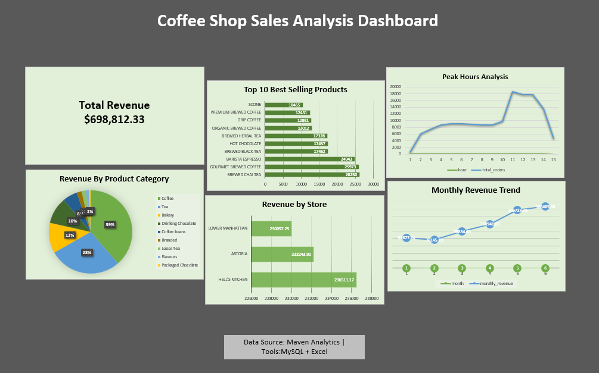

# ☕ Coffee Shop Sales Analysis
Sales analysis of a coffee shop using MySQL and Excel. Includes SQL queries and interactive dashboard.

## 📌 Project Overview
Analysis of coffee shop sales data using MySQL and Excel to uncover 
business insights like revenue trends, top products, and peak hours.

## 🛠️ Tools Used
- *MySQL* — data storage and querying
- *Excel* — data visualization and dashboard

## 📊 Key Insights
- Total Revenue: *$698,812.33*
- Top Store: *Hell's Kitchen* with $236,511
- Best Selling Product: *Brewed Chai Tea*
- Peak Hours: *10AM - 11AM*
- Top Category: *Coffee* (39% of revenue)

## 📁 Files
| File | Description |
|------|-------------|
| coffee_shop_sales project.sql | All SQL queries |
| coffee_sales.xlsx | Excel dashboard |
| dashboard_preview.png | Dashboard screenshot |

## 🔍 SQL Queries Include
- Total Revenue
- Revenue by Store Location
- Top 10 Best Selling Products
- Monthly Revenue Trend
- Revenue by Product Category
- Peak Hours Analysis

## 📷 Dashboard Preview

## 📂 Data Source
Maven Analytics — Coffee Shop Sales Dataset
